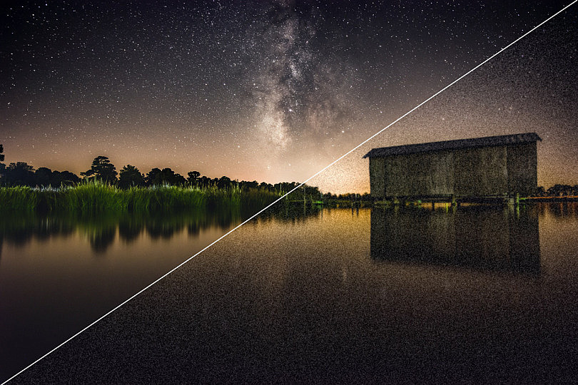
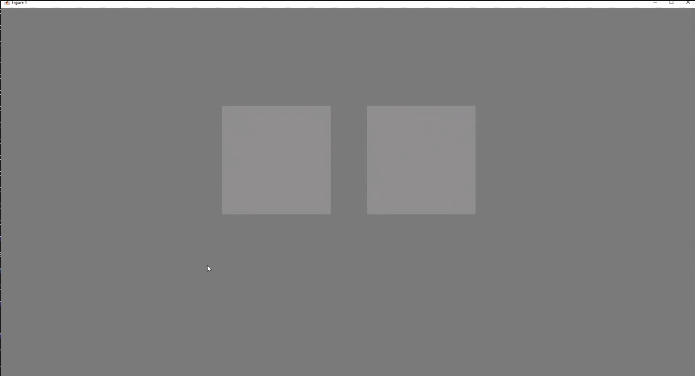
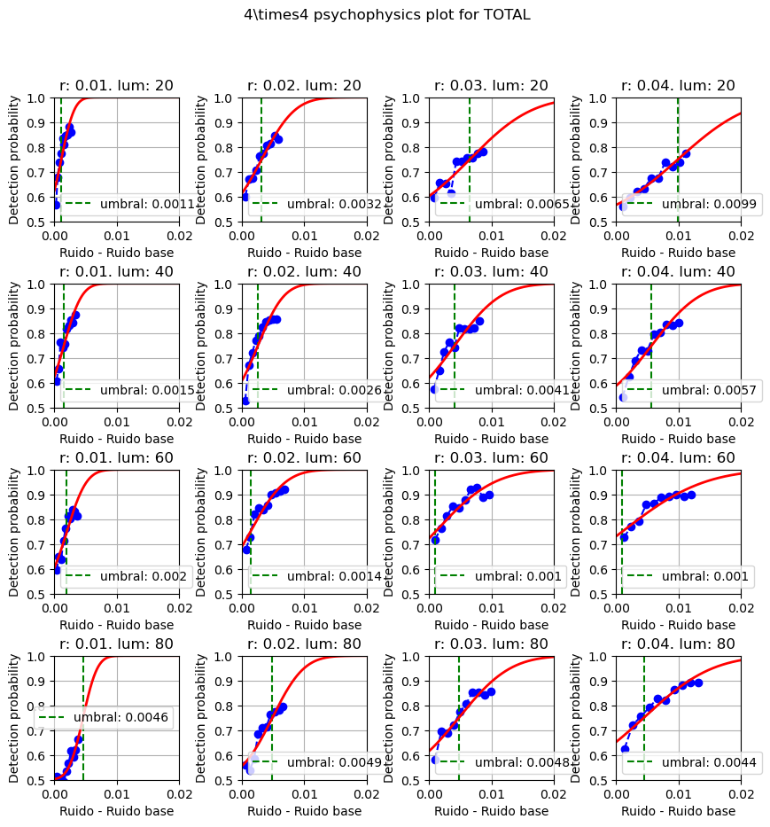

<h1 align="center"> Detección de ruido en imágenes</h1>
<p align="center"> Trabajo de Fin de Máster en Inteligencia de Negocio y Big Data en Entornos Seguros</p>

---
Autor:
- [Luis Miguel Calvo Magaz](mailto:luismicalvomagaz@gmail.com)

Tutores: 
- [Pedro Latorre Carmona](mailto:plcarmona@ubu.es)
- [Samuel Morillas Gómez](mailto:smorillas@mat.upv.es)
- [Rafael Huertas Roa](mailto:rhuertas@ugr.es)

<p align="center"></p> 


## Tabla de contenidos:
---

- [Introducción](#introducción)
- [Contenido](#contenido)
- [Resumen](#resumen)
- [Requirements](#requirements)


## Introducción
---
En este proyecto queremos determinar cuál es el mínimo nivel de ruido que tendríamos que añadir a una imágen para que sea percibible por el ojo humano.

Para ello partimos de dos tomas de datos realizadas por la Universidad de Granada y la Universidad de Sevilla con 68 voluntarios donde se realizaron varios experimentos psicofísicos partiendo de cuatro niveles de ruido base (0.01, 0.02, 0.03 y 0.04) en cuatro niveles de luminancia distintas (20, 40, 60 y 80).


## Contenido
---
Para realizar los cálculos de este proyecto se han implementado los scripts de este repositorio y que están descritos y explicados en [STEPS](/STEPS.md)

## Resumen
---
En estos experimentos se le presenta al voluntario dos imágenes, una con un nivel de ruido y la otra con algo de ruido extra que se ha incrementado.
El voluntario debe elegir cuál es la imágen en la que percibe más ruido. Esto se repite tres veces para cada nivel de ruido base e incremento.

<p align="center"></p>

Almacenamos la tasa de acierto que tiene el voluntario sobre cada experimento individual de los tres experimentos.

Por lo tanto tendríamos un total de 160 tasas de acierto por cada sesión experimental (4 niveles de ruido, 10 incrementos de ruido por cada nivel de ruido y 4 luminancias), cada voluntario ha realizado aproximadamente dos sesiones.

En el transcurso del trabajo se realizan pruebas estadísticas que determinan que ambos grupos de datos (Universidad de Granada y Universidad de Valencia) pueden ser promediados para obtener conclusiones generales.

Así podríamos calcular cuál es el umbral medio de detección para cada combinación de ruido base con luminancia, como podemos observar en el siguiente gráfico, donde la luminancia incrementa verticalmente (20, 40, 60 y 80) y el ruido base horizontalmente (0.01, 0.02, 0.03 y 0.04)

<p align="center"></p>


## Requirements
Este proyecto tiene dependencias con varias librerias de python, para instalarlas basta con ejecutar el siguiente comando:
```
pip3 install -r requirements.txt
```
