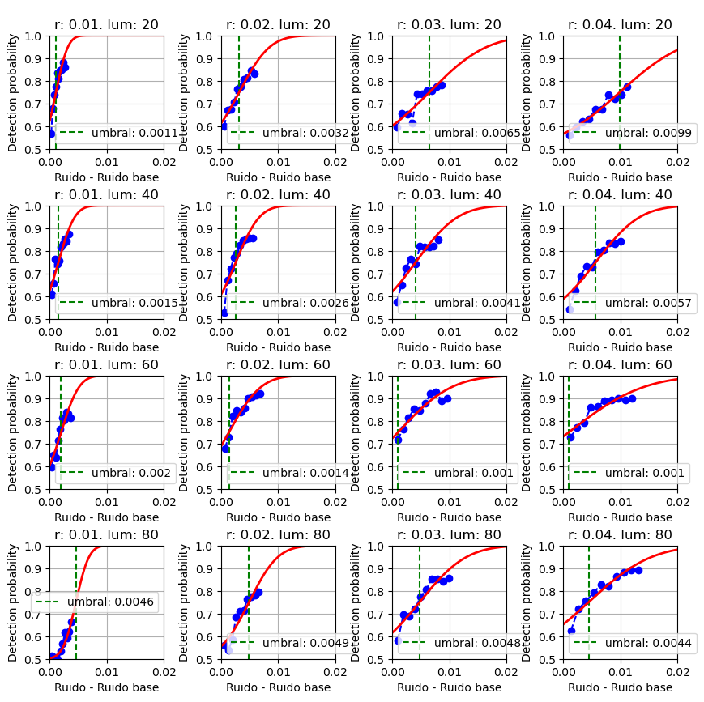

<h1 align="center">Análisis de datos de experimentos psicofísicos y determinación de umbrales de detección de ruido en imágenes</h1>
<p align="center"> Trabajo de Fin de Máster en Inteligencia de Negocio y Big Data en Entornos Seguros</p>

---
Autor:
- [Luis Miguel Calvo Magaz](mailto:luismicalvomagaz@gmail.com)

Tutores: 
- [Pedro Latorre Carmona](https://scholar.google.com/citations?user=3Rm-8d8AAAAJ&hl=en)
- [Rafael Huertas Roa](https://scholar.google.es/citations?user=tyJqxDEAAAAJ&hl=en)
- [Samuel Morillas Gómez](https://viplab.webs.upv.es/)
<p align="center"></p> 


## Tabla de contenidos:
---

- [Introducción](#introducción)
- [Contenido](#contenido)
- [Requirements](#requirements)


## Introducción
---
El ruido en imágenes se puede describir como las fluctuaciones imprevistas y aleatorias en los valores de los píxeles de una imagen que puede causar cambios en el brillo y color de los mismos, generando granularidad o manchas que no forman parte del contenido visual original. El ruido puede surgir debido a numerosos factores, como limitaciones de los sensores de las cámaras durante la adquisición de la imagen, interferencias eléctricas o errores al almacenarlas digitalmente, y puede afectar en una gran variedad de ámbitos en los que el protagonista es la adquisición o almacenamiento de imágenes, desde la fotografía o cine, afectando a la calidad visual de los fotografías y escenas, hasta la ciencia y astronomía, donde cualquier perturbación en la imagen captada puede dificultar el análisis e interpretación de los datos obtenidos.

La distinción entre ruido y contenido visual relevante es fundamental para garantizar que una imagen mantenga su calidad, nitidez e intención comunicativa. No obstante, enfrentar este desafío no es un proceso simple ni directo. En la búsqueda por reducir el ruido, surge el el problema de que cada paso para disminuir el mismo tiene un efecto colateral potencial en la calidad visual de la imagen. Esto se debe a que las técnicas de reducción de ruido a menudo implican un suavizado de la imagen, que puede afectar negativamente en  los detalles y las texturas. La eliminación completa del ruido podría llevar a la pérdida de información visual valiosa y a la generación de una imagen suavizada pero poco realista. Es importante encontrar un compromiso adecuado: uno que permita reducir el ruido de manera efectiva sin sacrificar en gran medida la autenticidad y la calidad de la imagen.

Al mínimo nivel de ruido que se le debe incrementar a una imagen para que sea detectado por el sistema visual humano se le denomina diferencia justamente perceptible (JND). El objetivo de este trabajo consiste en encontrar cuáles son las diferencias justamente perceptibles para múltiples combinaciones de niveles de ruido base y luminancia, y determinar un modelo que pueda predecir esos umbrales. Para ello se han llevado a cabo experimentos psicofísicos utilizando el método de ''elección forzosa entre dos alternativas'' en las universidades de Granada y Politécnica de Valencia para niveles de ruido base entre $0.1$ y $0.4$ y luminancias entre $20$ y $80$ a más de 60 voluntarios. Durante estos experimentos, los participantes se encargaron de seleccionar entre una imagen con un ruido base y otra con un ruido incrementado, cuál era la que percibían como la más afectada por el ruido.

<p align="center"></p>

Este estudio ha logrado determinar los umbrales de detección de ruido para cada combinación de ruido base y luminancia a partir de los experimentos realizados. Además, se ha desarrollado un modelo de predicción para el umbral de la diferencia justamente perceptible (JND), considerando tanto el nivel de ruido base presente en la imagen como su luminancia. Asimismo, se ha llevado a cabo un análisis detallado según la edad, el género y la experiencia en pruebas psicofísicas, con el objetivo de investigar cómo estas variables pueden influir en la percepción de la diferencia justamente perceptible.

<p align="center"></p>

En la figura de 4x4 gráficos se representan la probabilidad de detección de que el ruido se ha incrementado en función del incremento del ruido en si mismo (ruido de la imagen - ruido base). La diferencia Justamente Perceptible (JND) es el incremento en el que la probabilidad de detección es del 75% (marcado como una línea vertical verde discontinua). También se representa la normal acumulada de las tasas de acierto tomando como media el JND.


## Contenido
---
Para realizar los cálculos de este proyecto se han implementado los scripts descritos en  [STEPS](/STEPS.md).


## Requirements
Este proyecto tiene dependencias con varias librerias de python, para instalarlas basta con ejecutar el siguiente comando:
```
pip3 install -r requirements.txt
```
